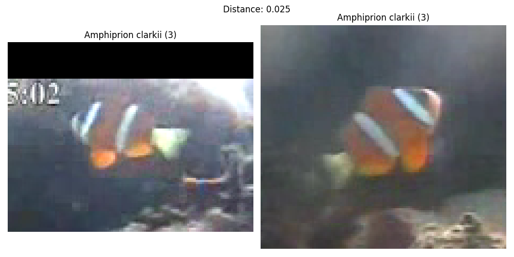
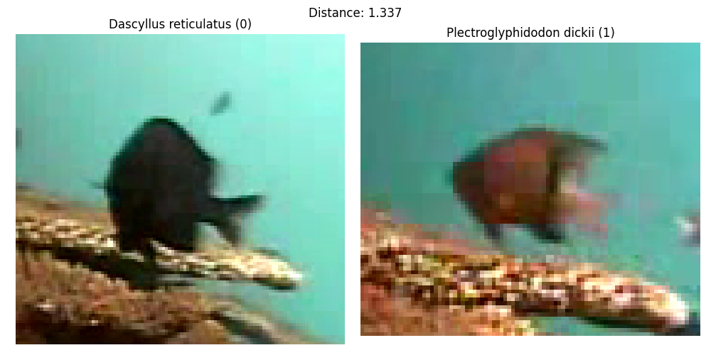

# Fish classification using siamese neural networks

This repository contains the code that was developed and used for the IKT450 fish classification project.

## Content
[siamese.py](siamese.py): Code for training and testing the siamese neural networks.

[dataset_functions.py](dataset_functions.py): Functions that were used to download, prepare, and analyze the dataset.

[create_report_things.py](create_report_things.py): Create graphs, confusion matrices, etc. for the report.

[dataset.csv](dataset.csv): The images that were used, and how they were distributed into train/validation/test sets.

[data](/data/): Contains statistics that were collected during training and testing.

[drawio-diagrams](/drawio-diagrams/): Contains diagrams that were used in the report.

## Examples

